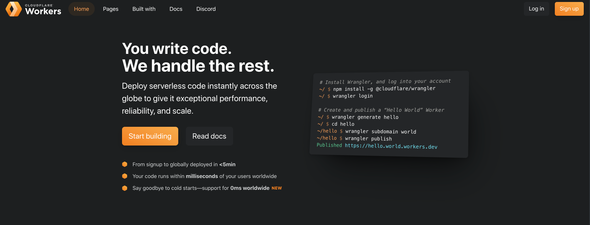
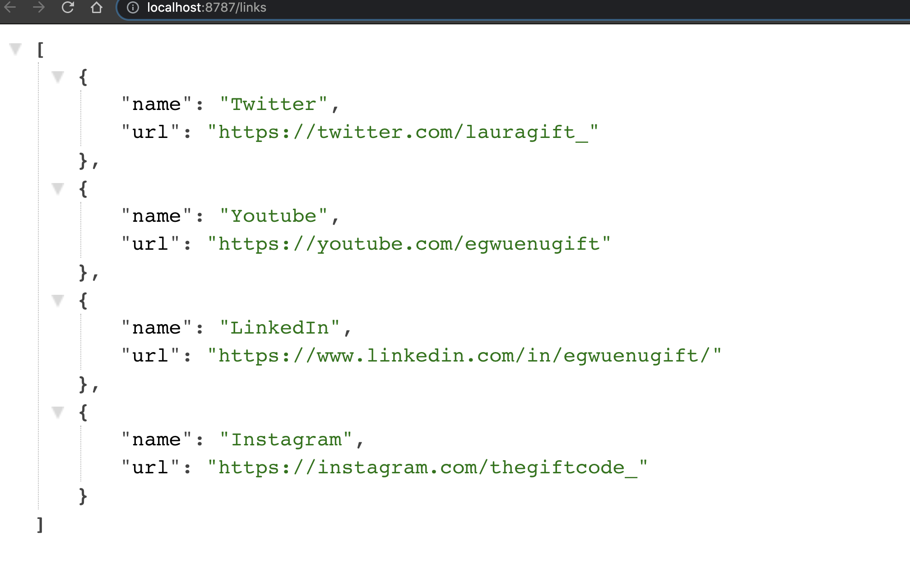
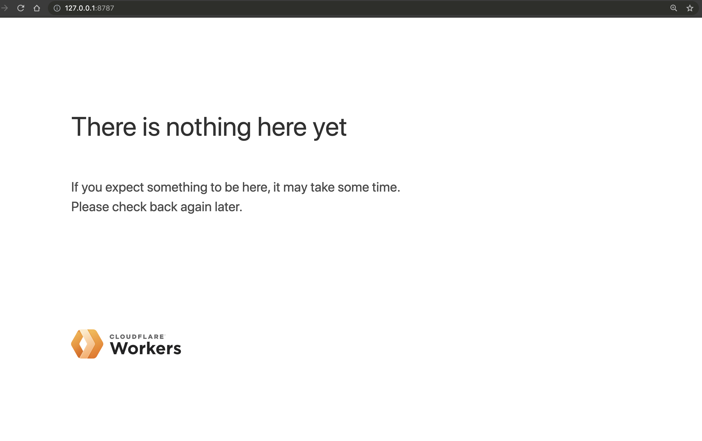
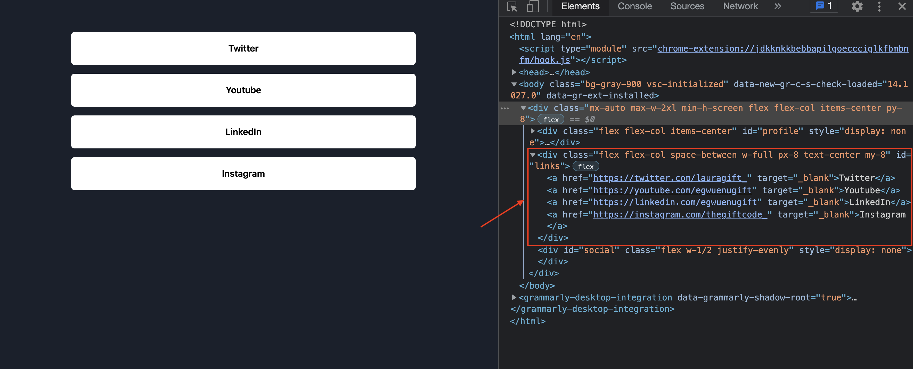
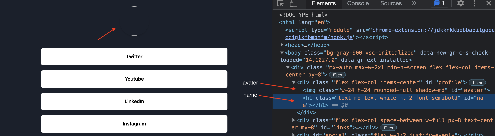
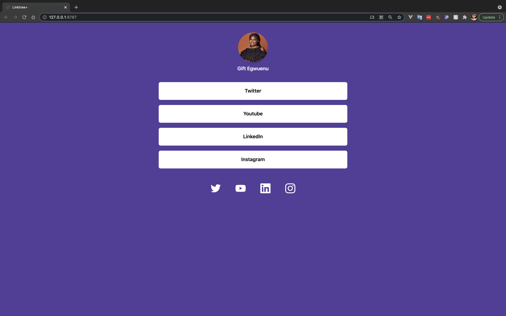
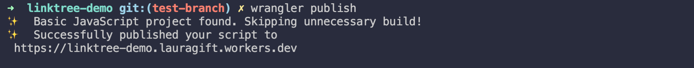

# Build a Linktree Site with Cloudflare Workers

## Introduction

The web has evolved so much now that the possibilities are endless. In the past, when we needed to build a fully functional API, we had to spin up our servers. With the serverless architecture, we can now build APIs without managing our servers but rely on services that provide us with servers on-demand on an as-used basis.

This tutorial will build a linktree-like site with [Cloudflare Workers](https://workers.cloudflare.com/) and get our code deployed to servers across the globe that we can access in milliseconds.

## What is Cloudflare Workers?

Cloudflare Workers provides a serverless execution environment that allows you to create entirely new applications or augment existing ones without configuring or maintaining infrastructure.



## Prerequisite

To follow along in this tutorial, you need to have previous knowledge of JavaScript, Serverless Technology, and a Cloudflare Account.

## What We'll Build?

In this tutorial, we will build a linktree site with the following requirements:

- Deploy a JSON API and serve the response to the path `/links.`
- Serve a Static HTML Page with the data from the JSON API.

First, we need to set up a Cloudflare Workers project using [Wrangler](https://github.com/cloudflare/wrangler). Wrangler is the CLI tool you use in building Cloudflare Workers.

### **Installation Guide**

You can install Wrangler globally using npm:

```bash
npm i @cloudflare/wrangler -g
```

or install with Yarn:

```bash
yarn global add @cloudflare/wrangler
```

Once this is completed, test that you have it all set up with the `wrangler whoami` command. 

You should see a prompt that you're not currently authenticated. You need to log in first using the `wrangler login` command.
This command will open up a Cloudflare account login page to authenticate Wrangler. After successful login, you should see your email and `account_id` when you run `wrangler whoami`.

### **Create a Worker Project**

Let's create a new worker project with `wrangler generate` command. With this command, you need to also pass in the name of your project. In our case, we will use this command:

```bash
wrangler generate linktree-demo
```

The command will spin up a new worker project with some pre-generated files. The file we'll be working with is the `index.js` file. This file is where we will write the code for our workers.

You can also build your workers using the [Workers Playground](https://cloudflareworkers.com/#36ebe026bf3510a2e5acace89c09829f:about:blank), and this can be useful when you want to experiment with Cloudflare workers quickly, requiring no setup.

Let's review what we want to build. We need to generate a JSON API, an array of link objects with a name and URL string, and ensure that the array has at least three link objects.

### Creating the JSON API Request

Let's create an array of link objects with name and URL defined and set up a request handler to render the response to the path `/links`.

```jsx
const links = [
  {
    'name': 'Twitter',
    'url': 'https://twitter.com/lauragift_',
  },
  {
    'name': 'Youtube',
    'url': 'https://youtube.com/egwuenugift',
  },
  {
    'name': 'LinkedIn',
    'url': 'https://www.linkedin.com/in/egwuenugift/',
 },
 {
    'name': 'Instagram',
    'url': 'https://instagram.com/thegiftcode_',
 }
];
```

Now let's set up an event handler that returns a response object in this case, the links array that is passed to the event’s `.respondWith()` method.

```jsx
addEventListener("fetch", event => {
  event.respondWith(handleJSONRequest(event.request))
})

async function handleJSONRequest(request) {
	const init = {
		headers: {
			'content-type': 'application/json'
		}
	}
  return new Response(JSON.stringify(links), init)
}
```

Now, if you want to test this, you can run the command `wrangler dev` to test your worker locally, and you'll get a page that returns the link array as a JSON response and visiting [localhost:8787/links](http://localhost:8787/links) should also return the same response.



### Creating the HTML Page

In the second part of this project, We need to ensure the JSON API is only returned when accessing it from the path `/links`. If the path requested is not `/links`, we need to render an HTML page with data from JSON API response.

Let's update the event handler to ensure the JSON response is only displayed when we request the path `/links` :

```jsx
addEventListener("fetch", event => {
	const url = new URL(event.request.url);
	if (url.pathname.endsWith('/links')) {
    event.respondWith(handleJSONRequest(event.request))
  }
})
```

If we visit the index page, we should see an empty page returned because we only render the response on the links page.



Let's retrieve the Static HTML page we'll work on within another worker request and display it on the index page. The worker should begin by making a fetch request to [https://static-links-page.signalnerve.workers.dev](https://static-links-page.signalnerve.workers.dev/).

```jsx
async function handleHTMLRequest(request) {
  const init = {
    headers: {
      'content-type': 'text/html',
    },
  }
  const html = await fetch('https://static-links-page.signalnerve.workers.dev')
	return new Response(html, init)
}
```

and we let's update the event handler to this:

```jsx
addEventListener('fetch', event => {
  const url = new URL(event.request.url);
  if (url.pathname.endsWith('/links')) {
    event.respondWith(handleJSONRequest(event.request))
  } else {
    event.respondWith(handleHTMLRequest(event.request))
  }
})
```

The request will render the JSON data on the `/links` page and generate the static HTML on every other page. 

Now that we retrieved the HTML page, we want to enhance it using the **HTMLRewriter class** and update the page to render the links in the JSON response, profile image, name tag, and some SVG icons.

[HTMLRewriter](https://developers.cloudflare.com/workers/runtime-apis/html-rewriter) allows developers to build complete and expressive HTML parsers inside of a Cloudflare Workers application. It can be thought of as a jQuery-like experience directly inside of your Workers application.

We need to instantiate an HTMLRewriter handler once in the script using the `on` functions.

Let's do this in the handleHTMLRequest function:

```jsx
const rewriter = new HTMLRewriter().on()
```

HTMLRewriter has two types of handlers: element handlers and document handlers. We'll be using the element handler in this project because we want to update specific elements on the page.

In order to use the links inside of your HTMLRewriter handler, you can use a custom class to pass in arguments, for instance:

```jsx
class LinksTransformer {
  constructor(links) {
    this.links = links
  }
  
  async element(element) {
		// target the selector we want to update and add a new a for each link
		for (let link of links) {
	      element.append(`<a href='${link.url}' target='_blank'>${link.name}</a>`, { html: true });
	  }
  }
}
async function handleHTMLRequest(request) {
  const init = {
    headers: {
      'content-type': 'text/html',
    },
  }
  const html = await fetch('https://static-links-page.signalnerve.workers.dev')
	// inside the on function we can target the selector and pass LinksTransformer element handler
  const rewriter = new HTMLRewriter()
    .on('div#links', new LinksTransformer(links))
    .transform(html)
  return new Response(rewriter.body, init)
}
```

Let's rerun the `wrangler dev` command. We should see all the links populated inside the `div#links` element.



Nice! We have an excellent-looking site, but we can do more. If you inspect the HTML page, there's an additional div with id `profile` and `social`. Let's transform them too to display an avatar, name and a list of icons.

Let's remove the `display: none` style from `div#profile` and `div#social`using the same approach of element handlers in this case we need a new handler that removes the style display-none from `div#profile` and `div#social`.

```jsx
class DisplayTransformer {
  async element(element) {
    element.removeAttribute('style');
  }
}

async function handleHTMLRequest(request) {
  const rewriter = new HTMLRewriter()
    .on('div#links', new LinksTransformer(links))
    .on('div#profile', new DisplayTransformer())
    .on('div#social', new DisplayTransformer())
    .transform(html)
  return new Response(rewriter.body, init)
}
```

Let's update the two child elements inside `div#profile` one needs to show the avater and the other a name.



```jsx
class ImageTransformer {
  constructor(name, value) {
    this.name = name
    this.value = value
  }
  async element(element) {
    element.setAttribute(this.name, this.value);
  }
}

class UserNameTransformer {
  constructor(name) {
    this.name = name
  }
  async element(element) {
    element.prepend(this.name);
  }
}

async function handleHTMLRequest(request) {
  const rewriter = new HTMLRewriter()
    .on('img#avatar', new ImageTransformer('src', 'https://res.cloudinary.com/lauragift/image/upload/w_1000,ar_1:1,c_fill,g_auto/v1624353138/4EFA5623-1143-4480-A319-F5389240D87A_hgsluf.jpg'))
    .on('h1#name', new UserNameTransformer('Gift Egwuenu'))
    .transform(html)
  return new Response(rewriter.body, init)
}
```

Next, let's add some social links. Target the `div#social` element and set the children of this container to the links object, with SVG icons as the children of those links.

```jsx
// update the links array with svg for each link
const links = [
  {
    'svg': '<svg role="img" viewBox="0 0 24 24" xmlns="http://www.w3.org/2000/svg"><title>Twitter</title><path fill="#fff" d="M23.953 4.57a10 10 0 01-2.825.775 4.958 4.958 0 002.163-2.723c-.951.555-2.005.959-3.127 1.184a4.92 4.92 0 00-8.384 4.482C7.69 8.095 4.067 6.13 1.64 3.162a4.822 4.822 0 00-.666 2.475c0 1.71.87 3.213 2.188 4.096a4.904 4.904 0 01-2.228-.616v.06a4.923 4.923 0 003.946 4.827 4.996 4.996 0 01-2.212.085 4.936 4.936 0 004.604 3.417 9.867 9.867 0 01-6.102 2.105c-.39 0-.779-.023-1.17-.067a13.995 13.995 0 007.557 2.209c9.053 0 13.998-7.496 13.998-13.985 0-.21 0-.42-.015-.63A9.935 9.935 0 0024 4.59z"/></svg>'
  },
	//...
  {
    'svg': '<svg role="img" viewBox="0 0 24 24" xmlns="http://www.w3.org/2000/svg"><title>Instagram</title><path fill="#fff" d="M12 0C8.74 0 8.333.015 7.053.072 5.775.132 4.905.333 4.14.63c-.789.306-1.459.717-2.126 1.384S.935 3.35.63 4.14C.333 4.905.131 5.775.072 7.053.012 8.333 0 8.74 0 12s.015 3.667.072 4.947c.06 1.277.261 2.148.558 2.913.306.788.717 1.459 1.384 2.126.667.666 1.336 1.079 2.126 1.384.766.296 1.636.499 2.913.558C8.333 23.988 8.74 24 12 24s3.667-.015 4.947-.072c1.277-.06 2.148-.262 2.913-.558.788-.306 1.459-.718 2.126-1.384.666-.667 1.079-1.335 1.384-2.126.296-.765.499-1.636.558-2.913.06-1.28.072-1.687.072-4.947s-.015-3.667-.072-4.947c-.06-1.277-.262-2.149-.558-2.913-.306-.789-.718-1.459-1.384-2.126C21.319 1.347 20.651.935 19.86.63c-.765-.297-1.636-.499-2.913-.558C15.667.012 15.26 0 12 0zm0 2.16c3.203 0 3.585.016 4.85.071 1.17.055 1.805.249 2.227.415.562.217.96.477 1.382.896.419.42.679.819.896 1.381.164.422.36 1.057.413 2.227.057 1.266.07 1.646.07 4.85s-.015 3.585-.074 4.85c-.061 1.17-.256 1.805-.421 2.227-.224.562-.479.96-.899 1.382-.419.419-.824.679-1.38.896-.42.164-1.065.36-2.235.413-1.274.057-1.649.07-4.859.07-3.211 0-3.586-.015-4.859-.074-1.171-.061-1.816-.256-2.236-.421-.569-.224-.96-.479-1.379-.899-.421-.419-.69-.824-.9-1.38-.165-.42-.359-1.065-.42-2.235-.045-1.26-.061-1.649-.061-4.844 0-3.196.016-3.586.061-4.861.061-1.17.255-1.814.42-2.234.21-.57.479-.96.9-1.381.419-.419.81-.689 1.379-.898.42-.166 1.051-.361 2.221-.421 1.275-.045 1.65-.06 4.859-.06l.045.03zm0 3.678c-3.405 0-6.162 2.76-6.162 6.162 0 3.405 2.76 6.162 6.162 6.162 3.405 0 6.162-2.76 6.162-6.162 0-3.405-2.76-6.162-6.162-6.162zM12 16c-2.21 0-4-1.79-4-4s1.79-4 4-4 4 1.79 4 4-1.79 4-4 4zm7.846-10.405c0 .795-.646 1.44-1.44 1.44-.795 0-1.44-.646-1.44-1.44 0-.794.646-1.439 1.44-1.439.793-.001 1.44.645 1.44 1.439z"/></svg>'
  },
];

class SocialTransformer {
  constructor(links) {
    this.links = links
  }

  async element(element) {
    for (let link of links) {
      element.append(`<a href='${link.url}' target='_blank'>${link.svg}</a>`, { html: true });
    }
  }
}

async function handleHTMLRequest(request) {
  const rewriter = new HTMLRewriter()
    .on('div#social', new SocialTransformer(links))
    .transform(html)
  return new Response(rewriter.body, init)
}
```

With that, here's the output of the rendered HTML:


We can also make additional changes like switching the background color to another color class and changing the meta title name.

```jsx
class BackgroundTransformer {
  constructor(name, value) {
    this.name = name
    this.value = value
  }
  async element(element) {
    element.setAttribute(this.name, this.value);
  }
}

class MetaTitleTransformer {
  constructor(name) {
    this.name = name
  }
  async element(element) {
    element.setInnerContent(this.name, { html: true })
  }
}

async function handleHTMLRequest(request) {
  const init = {
    headers: {
      'content-type': 'text/html',
    },
  }
  const html = await fetch('https://static-links-page.signalnerve.workers.dev')
  const rewriter = new HTMLRewriter()
    .on('head > title', new MetaTitleTransformer('Linktree+'))
    .on('body', new BackgroundTransformer('class', 'bg-purple-800'))
    .transform(html)
  return new Response(rewriter.body, init)
}
```

We get a complete linktree site with all the functionalities we needed to get implemented.



This is the final version of the `handleHTMLRequest` function:

```jsx
async function handleHTMLRequest(request) {
  const init = {
    headers: {
      'content-type': 'text/html',
    },
  }
  const html = await fetch('https://static-links-page.signalnerve.workers.dev')
  const rewriter = new HTMLRewriter()
    .on('div#links', new LinksTransformer(links))
    .on('div#social', new SocialTransformer(links))
    .on('div#profile', new DisplayTransformer())
    .on('div#social', new DisplayTransformer())
    .on('img#avatar', new ImageTransformer('src', 'https://res.cloudinary.com/lauragift/image/upload/w_1000,ar_1:1,c_fill,g_auto/v1624353138/4EFA5623-1143-4480-A319-F5389240D87A_hgsluf.jpg'))
    .on('h1#name', new UserNameTransformer('Gift Egwuenu'))
    .on('head > title', new MetaTitleTransformer('Linktree+'))
    .on('body', new BackgroundTransformer('class', 'bg-purple-800'))
    .transform(html)
  return new Response(rewriter.body, init)
}
```

### Publishing the Worker

Finally, we can deploy the worker script using the command `wrangler publish`. You can either deploy to a custom domain or use [workers.dev](http://workers.dev) domain. Suppose you want to use [worker.dev](http://worker.dev) you first need to register a sub-domain.

You can use the `wrangler subdomain` command to configure a subdomain or use the web platform to set this up. and in the `wrangler.toml` file set `worker_dev` to true.

This will generate a subdomain for your worker and deploy your worker every time your run `wrangler publish`. 



## Wrapping Up

In this article, we learned how to build a linktree site using Cloudflare Workers. We explored using Wrangler to set up a work project, run it locally and deploy the worker, and use the HTMLRewriter API to build a comprehensive and fully functional application.

We've only scratched the surface of what's possible with workers and the freedom of building with a serverless architecture in mind. There are more ways to leverage this technology to create even larger-scale applications.